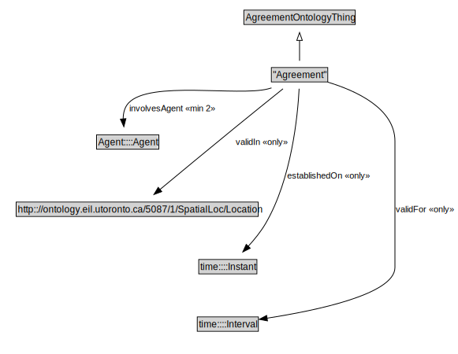

# "Agreement"

<a href="../../diagrams/"Agreement".svg">Open interactive "Agreement" diagram</a>

## Specializations of "Agreement"

| Class | Description |
|-------|-------------|
| ["Atomic Agreement"]("Atomic Agreement".md) |  |
| ["Complex Agreement"]("Complex Agreement".md) |  |
| [Conjunctive Agreement](ConjunctiveAgreement.md) |  |
| [Disjunctive Agreement](DisjunctiveAgreement.md) |  |

## Formalization for "Agreement"

| Property | Value Restriction | Definition |
|----------|-------------------|------------|
| establishedOn | only time::Instant | None |
| involvesAgent | min 2 [Agent](Agent.md)::[Agent](Agent.md) | None |
| rdfs:subClassOf | [AgreementOntologyThing](AgreementOntologyThing.md) | --- |
| validFor | only time::Interval | None |
| validIn | only http://ontology.eil.utoronto.ca/5087/1/SpatialLoc/Location | None |

