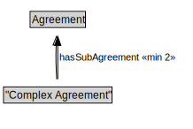

# "Complex Agreement"

<a href="../../diagrams/"Complex Agreement".svg">Open interactive "Complex Agreement" diagram</a>

## Specializations of "Complex Agreement"

| Class | Description |
|-------|-------------|
| [Conjunctive Agreement](ConjunctiveAgreement.md) |  |
| [Disjunctive Agreement](DisjunctiveAgreement.md) |  |

## Formalization for "Complex Agreement"

| Property | Value Restriction | Definition |
|----------|-------------------|------------|
| hasSubAgreement | min 2 [Agreement](Agreement.md) | None |
| rdfs:subClassOf | [Agreement](Agreement.md) | --- |

