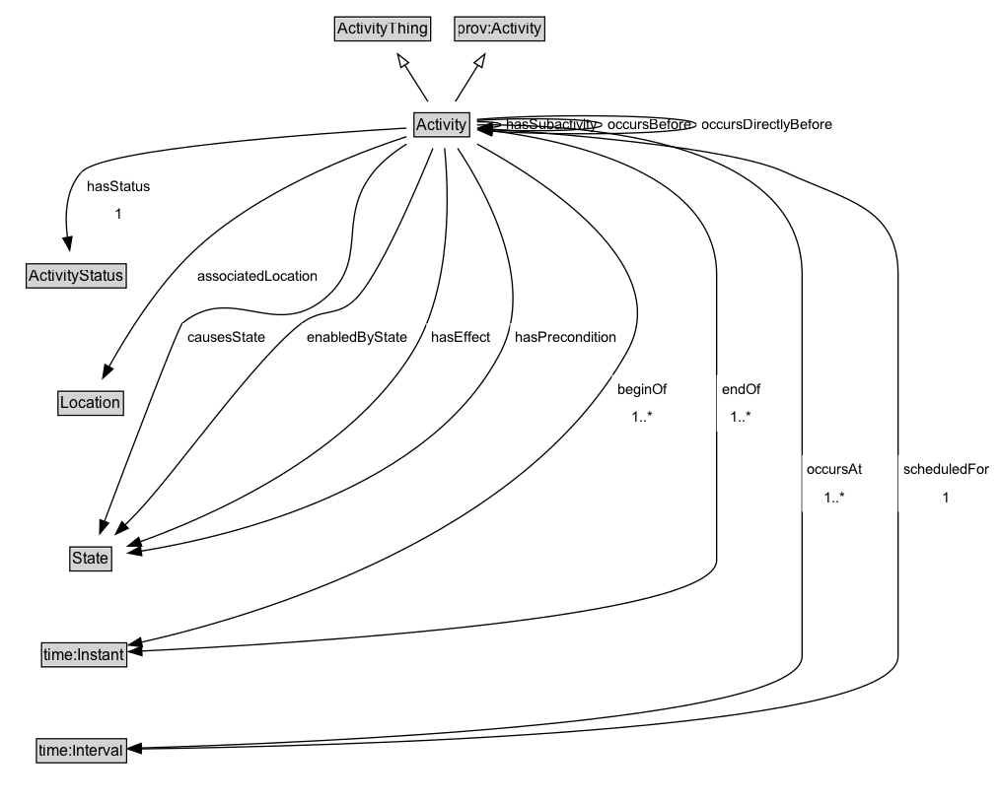

# Activity

An Activity describes something that occurs in the domain.
An Activity may be further defined by (decomposed into) Subactivities.
An Activity may have precondition and/or effect State.
An Activity may be enabled by or cause some State. An enabling of causing state is a generalization of a precondition/effect; an Activity is enabled by or causes some State if it has a subactivity with a precondition or effect (respectively) of that State. 
In other words, the state may not be required directly before, or cause directly after the activity, but by some more specialized sub-activity.
An Activity occurs at some point in time and space.
An Activity takes place during some interval, and so has some duration.
An Activity may have some Manifestations that participate in it.

**IRI**: `https://w3id.org/citydata/part1/v1/Activity`

## Diagram

=== "SVG (interactive)"

    <!-- Generated by graphviz version 14.1.3 (20260303.0454)
     -->
    <!-- Pages: 1 -->
    <svg width="760pt" height="610pt"
     viewBox="0.00 0.00 760.00 610.00" xmlns="http://www.w3.org/2000/svg" xmlns:xlink="http://www.w3.org/1999/xlink">
    <g id="graph0" class="graph" transform="scale(1 1) rotate(0) translate(4 605.5)">
    <polygon fill="white" stroke="none" points="-4,4 -4,-605.5 756.25,-605.5 756.25,4 -4,4"/>
    <g id="clust3" class="cluster">
    <title>cluster_associated</title>
    </g>
    <!-- ActivityThing -->
    <g id="node1" class="node">
    <title>ActivityThing</title>
    <g id="a_node1"><a xlink:href="../ActivityThing" xlink:title="&lt;TABLE&gt;">
    <polygon fill="lightgray" stroke="none" points="251.5,-575.38 251.5,-591.62 322.5,-591.62 322.5,-575.38 251.5,-575.38"/>
    <text xml:space="preserve" text-anchor="start" x="252.5" y="-579.38" font-family="Arial" font-size="12.00">ActivityThing</text>
    <polygon fill="none" stroke="black" points="250.5,-574.38 250.5,-592.62 323.5,-592.62 323.5,-574.38 250.5,-574.38"/>
    </a>
    </g>
    </g>
    <!-- prov_Activity -->
    <g id="node2" class="node">
    <title>prov_Activity</title>
    <g id="a_node2"><a xlink:href="https://w3id.org/citydata/imported/prov/latest/Activity" xlink:title="&lt;TABLE&gt;">
    <polygon fill="lightgray" stroke="none" points="342.75,-575.38 342.75,-591.62 409.25,-591.62 409.25,-575.38 342.75,-575.38"/>
    <text xml:space="preserve" text-anchor="start" x="343.75" y="-579.38" font-family="Arial" font-size="12.00">prov:Activity</text>
    <polygon fill="none" stroke="black" points="341.75,-574.38 341.75,-592.62 410.25,-592.62 410.25,-574.38 341.75,-574.38"/>
    </a>
    </g>
    </g>
    <!-- Activity -->
    <g id="node3" class="node">
    <title>Activity</title>
    <g id="a_node3"><a xlink:href="../Activity" xlink:title="&lt;TABLE&gt;">
    <polygon fill="lightgray" stroke="none" points="311.88,-502.38 311.88,-518.62 352.12,-518.62 352.12,-502.38 311.88,-502.38"/>
    <text xml:space="preserve" text-anchor="start" x="312.88" y="-506.38" font-family="Arial" font-size="12.00">Activity</text>
    <polygon fill="none" stroke="black" points="310.88,-501.38 310.88,-519.62 353.12,-519.62 353.12,-501.38 310.88,-501.38"/>
    </a>
    </g>
    </g>
    <!-- Activity&#45;&gt;ActivityThing -->
    <g id="edge1" class="edge">
    <title>Activity&#45;&gt;ActivityThing</title>
    <path fill="none" stroke="black" d="M321.41,-528.21C316.16,-536.5 309.68,-546.71 303.77,-556.04"/>
    <polygon fill="none" stroke="black" points="300.87,-554.08 298.47,-564.4 306.78,-557.82 300.87,-554.08"/>
    </g>
    <!-- Activity&#45;&gt;prov_Activity -->
    <g id="edge2" class="edge">
    <title>Activity&#45;&gt;prov_Activity</title>
    <path fill="none" stroke="black" d="M342.35,-528.21C347.49,-536.5 353.82,-546.71 359.6,-556.04"/>
    <polygon fill="none" stroke="black" points="356.53,-557.73 364.78,-564.39 362.48,-554.04 356.53,-557.73"/>
    </g>
    <!-- Activity&#45;&gt;Activity -->
    <g id="edge14" class="edge">
    <title>Activity&#45;&gt;Activity</title>
    <path fill="none" stroke="black" d="M358.79,-512.78C368.78,-512.85 377,-512.09 377,-510.5 377,-509.58 374.25,-508.94 370.01,-508.57"/>
    <polygon fill="black" stroke="black" points="370.41,-505.09 360.31,-508.27 370.19,-512.08 370.41,-505.09"/>
    <polygon fill="white" stroke="none" points="377,-499.75 377,-521.25 454,-521.25 454,-499.75 377,-499.75"/>
    <text xml:space="preserve" text-anchor="start" x="381" y="-506.75" font-family="Arial" font-size="11.00">hasSubactivity</text>
    </g>
    <!-- Activity&#45;&gt;Activity -->
    <g id="edge15" class="edge">
    <title>Activity&#45;&gt;Activity</title>
    <path fill="none" stroke="black" d="M358.76,-513.85C396,-516.23 454,-515.11 454,-510.5 454,-506.34 406.77,-505.02 370.19,-506.55"/>
    <polygon fill="black" stroke="black" points="370.08,-503.06 360.28,-507.07 370.44,-510.05 370.08,-503.06"/>
    <polygon fill="white" stroke="none" points="454,-499.75 454,-521.25 525.75,-521.25 525.75,-499.75 454,-499.75"/>
    <text xml:space="preserve" text-anchor="start" x="458" y="-506.75" font-family="Arial" font-size="11.00">occursBefore</text>
    </g>
    <!-- Activity&#45;&gt;Activity -->
    <g id="edge16" class="edge">
    <title>Activity&#45;&gt;Activity</title>
    <path fill="none" stroke="black" d="M358.71,-514.57C414.08,-519.32 525.75,-517.97 525.75,-510.5 525.75,-503.51 428.01,-501.88 370.07,-505.59"/>
    <polygon fill="black" stroke="black" points="369.93,-502.09 360.22,-506.32 370.45,-509.07 369.93,-502.09"/>
    <polygon fill="white" stroke="none" points="525.75,-499.75 525.75,-521.25 633.5,-521.25 633.5,-499.75 525.75,-499.75"/>
    <text xml:space="preserve" text-anchor="start" x="529.75" y="-506.75" font-family="Arial" font-size="11.00">occursDirectlyBefore</text>
    </g>
    <!-- Invis -->
    <!-- Activity&#45;&gt;Invis -->
    <!-- ActivityStatus -->
    <g id="node5" class="node">
    <title>ActivityStatus</title>
    <g id="a_node5"><a xlink:href="../ActivityStatus" xlink:title="&lt;TABLE&gt;">
    <polygon fill="lightgray" stroke="none" points="17,-387.38 17,-403.62 91,-403.62 91,-387.38 17,-387.38"/>
    <text xml:space="preserve" text-anchor="start" x="18" y="-391.38" font-family="Arial" font-size="12.00">ActivityStatus</text>
    <polygon fill="none" stroke="black" points="16,-386.38 16,-404.62 92,-404.62 92,-386.38 16,-386.38"/>
    </a>
    </g>
    </g>
    <!-- Activity&#45;&gt;ActivityStatus -->
    <g id="edge20" class="edge">
    <title>Activity&#45;&gt;ActivityStatus</title>
    <path fill="none" stroke="black" d="M305.22,-508C239.55,-504.07 74.67,-492.48 58,-474.5 45.91,-461.46 45.16,-441.3 47.3,-424.75"/>
    <polygon fill="black" stroke="black" points="50.74,-425.43 48.99,-414.98 43.84,-424.23 50.74,-425.43"/>
    <polygon fill="white" stroke="none" points="58,-431.5 58,-474.5 114,-474.5 114,-431.5 58,-431.5"/>
    <text xml:space="preserve" text-anchor="start" x="62" y="-460" font-family="Arial" font-size="11.00">hasStatus</text>
    <text xml:space="preserve" text-anchor="start" x="83" y="-438.5" font-family="Arial" font-size="11.00">1</text>
    </g>
    <!-- Location -->
    <g id="node6" class="node">
    <title>Location</title>
    <g id="a_node6"><a xlink:href="../Location" xlink:title="&lt;TABLE&gt;">
    <polygon fill="lightgray" stroke="none" points="41.12,-290.38 41.12,-306.62 88.88,-306.62 88.88,-290.38 41.12,-290.38"/>
    <text xml:space="preserve" text-anchor="start" x="42.12" y="-294.38" font-family="Arial" font-size="12.00">Location</text>
    <polygon fill="none" stroke="black" points="40.12,-289.38 40.12,-307.62 89.88,-307.62 89.88,-289.38 40.12,-289.38"/>
    </a>
    </g>
    </g>
    <!-- Activity&#45;&gt;Location -->
    <g id="edge9" class="edge">
    <title>Activity&#45;&gt;Location</title>
    <path fill="none" stroke="black" d="M305.17,-501.47C265.53,-488.49 190.8,-459.58 142.5,-413.5 115.38,-387.63 92.43,-350.74 78.71,-326"/>
    <polygon fill="black" stroke="black" points="81.97,-324.67 74.12,-317.54 75.81,-328 81.97,-324.67"/>
    <polygon fill="white" stroke="none" points="142.5,-384.75 142.5,-406.25 242,-406.25 242,-384.75 142.5,-384.75"/>
    <text xml:space="preserve" text-anchor="start" x="146.5" y="-391.75" font-family="Arial" font-size="11.00">associatedLocation</text>
    </g>
    <!-- State -->
    <g id="node7" class="node">
    <title>State</title>
    <g id="a_node7"><a xlink:href="../State" xlink:title="&lt;TABLE&gt;">
    <polygon fill="lightgray" stroke="none" points="50.12,-171.88 50.12,-188.12 79.88,-188.12 79.88,-171.88 50.12,-171.88"/>
    <text xml:space="preserve" text-anchor="start" x="51.12" y="-175.88" font-family="Arial" font-size="12.00">State</text>
    <polygon fill="none" stroke="black" points="49.12,-170.88 49.12,-189.12 80.88,-189.12 80.88,-170.88 49.12,-170.88"/>
    </a>
    </g>
    </g>
    <!-- Activity&#45;&gt;State -->
    <g id="edge10" class="edge">
    <title>Activity&#45;&gt;State</title>
    <path fill="none" stroke="black" d="M305.19,-495.81C296.23,-490.19 286.81,-482.99 280,-474.5 251.03,-438.38 277.95,-406.68 242,-377.5 204.47,-347.04 172.26,-389.98 134.75,-359.5 131.65,-356.98 93.95,-257.79 75.31,-208.39"/>
    <polygon fill="black" stroke="black" points="78.66,-207.36 71.85,-199.23 72.11,-209.83 78.66,-207.36"/>
    <polygon fill="white" stroke="none" points="134.75,-338 134.75,-359.5 202,-359.5 202,-338 134.75,-338"/>
    <text xml:space="preserve" text-anchor="start" x="138.75" y="-345" font-family="Arial" font-size="11.00">causesState</text>
    </g>
    <!-- Activity&#45;&gt;State -->
    <g id="edge11" class="edge">
    <title>Activity&#45;&gt;State</title>
    <path fill="none" stroke="black" d="M325.22,-492.56C312.31,-460.93 283.88,-394.58 266,-377.5 251.76,-363.89 241.33,-371.22 225.5,-359.5 191.57,-334.38 129.99,-246.69 101,-216 97.77,-212.58 94.3,-209.04 90.83,-205.59"/>
    <polygon fill="black" stroke="black" points="93.55,-203.36 83.96,-198.86 88.65,-208.36 93.55,-203.36"/>
    <polygon fill="white" stroke="none" points="225.5,-338 225.5,-359.5 310,-359.5 310,-338 225.5,-338"/>
    <text xml:space="preserve" text-anchor="start" x="229.5" y="-345" font-family="Arial" font-size="11.00">enabledByState</text>
    </g>
    <!-- Activity&#45;&gt;State -->
    <g id="edge12" class="edge">
    <title>Activity&#45;&gt;State</title>
    <path fill="none" stroke="black" d="M334.11,-492.69C337.33,-460.2 340.23,-387.6 310,-338 262.15,-259.51 158.54,-213.28 102.62,-193.1"/>
    <polygon fill="black" stroke="black" points="103.79,-189.81 93.2,-189.8 101.48,-196.41 103.79,-189.81"/>
    <polygon fill="white" stroke="none" points="320.34,-338 320.34,-359.5 373.34,-359.5 373.34,-338 320.34,-338"/>
    <text xml:space="preserve" text-anchor="start" x="324.34" y="-345" font-family="Arial" font-size="11.00">hasEffect</text>
    </g>
    <!-- Activity&#45;&gt;State -->
    <g id="edge13" class="edge">
    <title>Activity&#45;&gt;State</title>
    <path fill="none" stroke="black" d="M344.05,-492.58C365.07,-460.82 403.76,-390.7 377,-338 324.07,-233.78 173.94,-197.49 103.01,-185.93"/>
    <polygon fill="black" stroke="black" points="103.85,-182.52 93.43,-184.45 102.78,-189.43 103.85,-182.52"/>
    <polygon fill="white" stroke="none" points="384.06,-338 384.06,-359.5 469.31,-359.5 469.31,-338 384.06,-338"/>
    <text xml:space="preserve" text-anchor="start" x="388.06" y="-345" font-family="Arial" font-size="11.00">hasPrecondition</text>
    </g>
    <!-- time_Instant -->
    <g id="node8" class="node">
    <title>time_Instant</title>
    <g id="a_node8"><a xlink:href="https://w3id.org/citydata/imported/time/latest/Instant" xlink:title="&lt;TABLE&gt;">
    <polygon fill="lightgray" stroke="none" points="28.62,-98.88 28.62,-115.12 91.38,-115.12 91.38,-98.88 28.62,-98.88"/>
    <text xml:space="preserve" text-anchor="start" x="29.62" y="-102.88" font-family="Arial" font-size="12.00">time:Instant</text>
    <polygon fill="none" stroke="black" points="27.62,-97.88 27.62,-116.12 92.38,-116.12 92.38,-97.88 27.62,-97.88"/>
    </a>
    </g>
    </g>
    <!-- Activity&#45;&gt;time_Instant -->
    <g id="edge17" class="edge">
    <title>Activity&#45;&gt;time_Instant</title>
    <path fill="none" stroke="black" d="M358.82,-495.9C409.14,-468.47 509.48,-403.5 473,-338 394.38,-196.84 192.44,-136.77 103.34,-116.55"/>
    <polygon fill="black" stroke="black" points="104.29,-113.18 93.77,-114.44 102.78,-120.01 104.29,-113.18"/>
    <polygon fill="white" stroke="none" points="461.42,-277 461.42,-320 506.92,-320 506.92,-277 461.42,-277"/>
    <text xml:space="preserve" text-anchor="start" x="465.42" y="-305.5" font-family="Arial" font-size="11.00">beginOf</text>
    <text xml:space="preserve" text-anchor="start" x="475.92" y="-284" font-family="Arial" font-size="11.00">1..&#42;</text>
    </g>
    <!-- Activity&#45;&gt;time_Instant -->
    <g id="edge18" class="edge">
    <title>Activity&#45;&gt;time_Instant</title>
    <path fill="none" stroke="black" d="M358.9,-507.35C415.34,-501.22 541,-478.38 541,-396.5 541,-396.5 541,-396.5 541,-179 541,-135.03 222.41,-115.6 103.8,-109.89"/>
    <polygon fill="black" stroke="black" points="103.97,-106.4 93.82,-109.43 103.64,-113.39 103.97,-106.4"/>
    <polygon fill="white" stroke="none" points="541,-277 541,-320 578.25,-320 578.25,-277 541,-277"/>
    <text xml:space="preserve" text-anchor="start" x="545" y="-305.5" font-family="Arial" font-size="11.00">endOf</text>
    <text xml:space="preserve" text-anchor="start" x="551.38" y="-284" font-family="Arial" font-size="11.00">1..&#42;</text>
    </g>
    <!-- time_Interval -->
    <g id="node9" class="node">
    <title>time_Interval</title>
    <g id="a_node9"><a xlink:href="https://w3id.org/citydata/imported/time/latest/Interval" xlink:title="&lt;TABLE&gt;">
    <polygon fill="lightgray" stroke="none" points="24.75,-25.88 24.75,-42.12 91.25,-42.12 91.25,-25.88 24.75,-25.88"/>
    <text xml:space="preserve" text-anchor="start" x="25.75" y="-29.88" font-family="Arial" font-size="12.00">time:Interval</text>
    <polygon fill="none" stroke="black" points="23.75,-24.88 23.75,-43.12 92.25,-43.12 92.25,-24.88 23.75,-24.88"/>
    </a>
    </g>
    </g>
    <!-- Activity&#45;&gt;time_Interval -->
    <g id="edge19" class="edge">
    <title>Activity&#45;&gt;time_Interval</title>
    <path fill="none" stroke="black" d="M358.77,-510.38C427.72,-511.12 606,-502.76 606,-396.5 606,-396.5 606,-396.5 606,-106 606,-55.42 234.13,-39.99 103.06,-36.13"/>
    <polygon fill="black" stroke="black" points="103.47,-32.64 93.38,-35.85 103.28,-39.63 103.47,-32.64"/>
    <polygon fill="white" stroke="none" points="606,-216 606,-259 656,-259 656,-216 606,-216"/>
    <text xml:space="preserve" text-anchor="start" x="610" y="-244.5" font-family="Arial" font-size="11.00">occursAt</text>
    <text xml:space="preserve" text-anchor="start" x="622.75" y="-223" font-family="Arial" font-size="11.00">1..&#42;</text>
    </g>
    <!-- Activity&#45;&gt;time_Interval -->
    <g id="edge21" class="edge">
    <title>Activity&#45;&gt;time_Interval</title>
    <path fill="none" stroke="black" d="M358.92,-507.92C416.92,-504.19 551.75,-493.67 593,-474.5 639.8,-452.76 679,-448.1 679,-396.5 679,-396.5 679,-396.5 679,-106 679,-48.01 246.1,-37.36 103.18,-35.43"/>
    <polygon fill="black" stroke="black" points="103.39,-31.93 93.34,-35.3 103.3,-38.93 103.39,-31.93"/>
    <polygon fill="white" stroke="none" points="679,-216 679,-259 752.25,-259 752.25,-216 679,-216"/>
    <text xml:space="preserve" text-anchor="start" x="683" y="-244.5" font-family="Arial" font-size="11.00">scheduledFor</text>
    <text xml:space="preserve" text-anchor="start" x="712.62" y="-223" font-family="Arial" font-size="11.00">1</text>
    </g>
    <!-- Invis&#45;&gt;ActivityStatus -->
    <!-- ActivityStatus&#45;&gt;Location -->
    <!-- Location&#45;&gt;State -->
    <!-- State&#45;&gt;time_Instant -->
    <!-- time_Instant&#45;&gt;time_Interval -->
    </g>
    </svg>

=== "PNG"

    

## Formalization for Activity

| Property | Constraint |
|----------|------------|
| [associatedLocation](../properties/associatedLocation.md) | only [Location](Location.md) |
| [associatedLocation](../properties/associatedLocation.md) | only [Location](https://w3id.org/citydata/part1/v1/Location) |
| [beginOf](../properties/beginOf.md) | min 1 |
| [beginOf](../properties/beginOf.md) | min 1 [time:Instant](http://www.w3.org/2006/time#Instant) |
| [causesState](../properties/causesState.md) | only [State](State.md) |
| [causesState](../properties/causesState.md) | only [State](https://w3id.org/citydata/part1/v1/State) |
| [enabledByState](../properties/enabledByState.md) | only [State](State.md) |
| [enabledByState](../properties/enabledByState.md) | only [State](https://w3id.org/citydata/part1/v1/State) |
| [endOf](../properties/endOf.md) | min 1 |
| [endOf](../properties/endOf.md) | min 1 [time:Instant](http://www.w3.org/2006/time#Instant) |
| [hasEffect](../properties/hasEffect.md) | only [State](State.md) |
| [hasEffect](../properties/hasEffect.md) | only [State](https://w3id.org/citydata/part1/v1/State) |
| [hasPrecondition](../properties/hasPrecondition.md) | only [State](State.md) |
| [hasPrecondition](../properties/hasPrecondition.md) | only [State](https://w3id.org/citydata/part1/v1/State) |
| [hasStatus](../properties/hasStatus.md) | exactly 1 |
| [hasStatus](../properties/hasStatus.md) | exactly 1 [ActivityStatus](https://w3id.org/citydata/part1/v1/ActivityStatus) |
| [hasSubactivity](../properties/hasSubactivity.md) | only [Activity](Activity.md) |
| [hasSubactivity](../properties/hasSubactivity.md) | only [Activity](https://w3id.org/citydata/part1/v1/Activity) |
| [occursAt](../properties/occursAt.md) | min 1 |
| [occursAt](../properties/occursAt.md) | min 1 [time:Interval](http://www.w3.org/2006/time#Interval) |
| [occursBefore](../properties/occursBefore.md) | only [Activity](Activity.md) |
| [occursBefore](../properties/occursBefore.md) | only [Activity](https://w3id.org/citydata/part1/v1/Activity) |
| [occursDirectlyBefore](../properties/occursDirectlyBefore.md) | only [Activity](Activity.md) |
| [occursDirectlyBefore](../properties/occursDirectlyBefore.md) | only [Activity](https://w3id.org/citydata/part1/v1/Activity) |
| [scheduledFor](../properties/scheduledFor.md) | exactly 1 |
| [scheduledFor](../properties/scheduledFor.md) | exactly 1 [time:Interval](http://www.w3.org/2006/time#Interval) |
| subClassOf | [prov:Activity](https://w3id.org/citydata/imported/prov/Activity) |
| subClassOf | [ActivityThing](ActivityThing.md) |

## Used by classes

| Class | Property |
|-------|----------|
| [Activity](Activity.md) | [hasSubactivity](../properties/hasSubactivity.md) |
| [Activity](Activity.md) | [occursBefore](../properties/occursBefore.md) |
| [Activity](Activity.md) | [occursDirectlyBefore](../properties/occursDirectlyBefore.md) |
| [Agent (FuzzyTime)](Agent.md) | [performs](../properties/performs.md) |
| [Recurring Event](RecurringEvent.md) | [hasOccurrence](../properties/hasOccurrence.md) |
| [State](State.md) | [causedByActivity](../properties/causedByActivity.md) |
| [State](State.md) | [effectOf](../properties/effectOf.md) |
| [State](State.md) | [enablesActivity](../properties/enablesActivity.md) |
| [State](State.md) | [preconditionOf](../properties/preconditionOf.md) |

