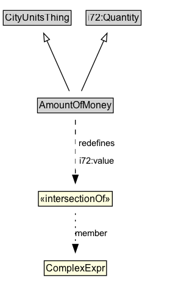

# AmountOfMoney

**IRI**: `https://w3id.org/citydata/part1/v1/AmountOfMoney`

## Diagram

=== "SVG (interactive)"

    <!-- Generated by graphviz version 14.1.3 (20260303.0454)
     -->
    <!-- Pages: 1 -->
    <svg width="240pt" height="353pt"
     viewBox="0.00 0.00 240.00 353.00" xmlns="http://www.w3.org/2000/svg" xmlns:xlink="http://www.w3.org/1999/xlink">
    <g id="graph0" class="graph" transform="scale(1 1) rotate(0) translate(4 348.5)">
    <polygon fill="white" stroke="none" points="-4,4 -4,-348.5 235.75,-348.5 235.75,4 -4,4"/>
    <g id="clust3" class="cluster">
    <title>cluster_associated</title>
    </g>
    <!-- CityUnitsThing -->
    <g id="node1" class="node">
    <title>CityUnitsThing</title>
    <g id="a_node1"><a xlink:href="../CityUnitsThing" xlink:title="&lt;TABLE&gt;">
    <polygon fill="lightgray" stroke="none" points="1,-318.38 1,-334.62 82.5,-334.62 82.5,-318.38 1,-318.38"/>
    <text xml:space="preserve" text-anchor="start" x="2" y="-322.38" font-family="Arial" font-size="12.00">CityUnitsThing</text>
    <polygon fill="none" stroke="black" points="0,-317.38 0,-335.62 83.5,-335.62 83.5,-317.38 0,-317.38"/>
    </a>
    </g>
    </g>
    <!-- i72_Quantity -->
    <g id="node2" class="node">
    <title>i72_Quantity</title>
    <g id="a_node2"><a xlink:href="https://w3id.org/citydata/21972/v1/Quantity" xlink:title="&lt;TABLE&gt;">
    <polygon fill="lightgray" stroke="none" points="102.88,-318.38 102.88,-334.62 168.62,-334.62 168.62,-318.38 102.88,-318.38"/>
    <text xml:space="preserve" text-anchor="start" x="103.88" y="-322.38" font-family="Arial" font-size="12.00">i72:Quantity</text>
    <polygon fill="none" stroke="black" points="101.88,-317.38 101.88,-335.62 169.62,-335.62 169.62,-317.38 101.88,-317.38"/>
    </a>
    </g>
    </g>
    <!-- AmountOfMoney -->
    <g id="node3" class="node">
    <title>AmountOfMoney</title>
    <g id="a_node3"><a xlink:href="../AmountOfMoney" xlink:title="&lt;TABLE&gt;">
    <polygon fill="lightgray" stroke="none" points="43.12,-210.38 43.12,-226.62 134.38,-226.62 134.38,-210.38 43.12,-210.38"/>
    <text xml:space="preserve" text-anchor="start" x="44.12" y="-214.38" font-family="Arial" font-size="12.00">AmountOfMoney</text>
    <polygon fill="none" stroke="black" points="42.12,-209.38 42.12,-227.62 135.38,-227.62 135.38,-209.38 42.12,-209.38"/>
    </a>
    </g>
    </g>
    <!-- AmountOfMoney&#45;&gt;CityUnitsThing -->
    <g id="edge1" class="edge">
    <title>AmountOfMoney&#45;&gt;CityUnitsThing</title>
    <path fill="none" stroke="black" d="M81.3,-236.3C73.89,-253.01 62.4,-278.92 53.71,-298.52"/>
    <polygon fill="none" stroke="black" points="50.56,-296.99 49.71,-307.55 56.96,-299.83 50.56,-296.99"/>
    </g>
    <!-- AmountOfMoney&#45;&gt;i72_Quantity -->
    <g id="edge2" class="edge">
    <title>AmountOfMoney&#45;&gt;i72_Quantity</title>
    <path fill="none" stroke="black" d="M96.2,-236.3C103.61,-253.01 115.1,-278.92 123.79,-298.52"/>
    <polygon fill="none" stroke="black" points="120.54,-299.83 127.79,-307.55 126.94,-296.99 120.54,-299.83"/>
    </g>
    <!-- n644d2ea6622c412bb8909c6637c88453b6 -->
    <g id="node5" class="node">
    <title>n644d2ea6622c412bb8909c6637c88453b6</title>
    <polygon fill="lightyellow" stroke="none" points="43.25,-94.38 43.25,-112.62 134.25,-112.62 134.25,-94.38 43.25,-94.38"/>
    <text xml:space="preserve" text-anchor="start" x="45.25" y="-99.38" font-family="Arial" font-size="12.00">«intersectionOf»</text>
    <polygon fill="none" stroke="black" points="43.25,-94.38 43.25,-112.62 134.25,-112.62 134.25,-94.38 43.25,-94.38"/>
    </g>
    <!-- AmountOfMoney&#45;&gt;n644d2ea6622c412bb8909c6637c88453b6 -->
    <g id="edge4" class="edge">
    <title>AmountOfMoney&#45;&gt;n644d2ea6622c412bb8909c6637c88453b6</title>
    <path fill="none" stroke="black" stroke-dasharray="5,2" d="M88.75,-200.83C88.75,-182.88 88.75,-154.04 88.75,-132.58"/>
    <polygon fill="black" stroke="black" points="92.25,-132.76 88.75,-122.76 85.25,-132.76 92.25,-132.76"/>
    <polygon fill="white" stroke="none" points="88.75,-139.5 88.75,-182.5 141,-182.5 141,-139.5 88.75,-139.5"/>
    <text xml:space="preserve" text-anchor="start" x="92.75" y="-168" font-family="Arial" font-size="11.00">redefines</text>
    <text xml:space="preserve" text-anchor="start" x="93.5" y="-146.5" font-family="Arial" font-size="11.00">i72:value</text>
    </g>
    <!-- Invis -->
    <!-- n644d2ea6622c412bb8909c6637c88453b7 -->
    <g id="node6" class="node">
    <title>n644d2ea6622c412bb8909c6637c88453b7</title>
    <polygon fill="lightyellow" stroke="none" points="50.38,-8.88 50.38,-27.12 127.12,-27.12 127.12,-8.88 50.38,-8.88"/>
    <text xml:space="preserve" text-anchor="start" x="52.38" y="-13.88" font-family="Arial" font-size="12.00">ComplexExpr</text>
    <polygon fill="none" stroke="black" points="50.38,-8.88 50.38,-27.12 127.12,-27.12 127.12,-8.88 50.38,-8.88"/>
    </g>
    <!-- n644d2ea6622c412bb8909c6637c88453b6&#45;&gt;n644d2ea6622c412bb8909c6637c88453b7 -->
    <g id="edge3" class="edge">
    <title>n644d2ea6622c412bb8909c6637c88453b6&#45;&gt;n644d2ea6622c412bb8909c6637c88453b7</title>
    <path fill="none" stroke="black" stroke-dasharray="1,5" d="M88.75,-85.6C88.75,-74.62 88.75,-60.04 88.75,-47.32"/>
    <polygon fill="black" stroke="black" points="92.25,-47.39 88.75,-37.39 85.25,-47.39 92.25,-47.39"/>
    <text xml:space="preserve" text-anchor="middle" x="108.62" y="-57.05" font-family="Arial" font-size="11.00">member</text>
    </g>
    </g>
    </svg>

=== "PNG"

    

## Specializations of AmountOfMoney

| Class | Description |
|-------|-------------|
| [Value Of Money](ValueOfMoney.md) | An amount of money that is defined relative to a particular year. |

## Formalization for AmountOfMoney

| Property | Constraint |
|----------|------------|
| [i72:value](https://w3id.org/citydata/21972/v1/value) | only ComplexExpr |
| subClassOf | [i72:Quantity](https://w3id.org/citydata/21972/v1/Quantity) |
| subClassOf | [CityUnitsThing](CityUnitsThing.md) |

