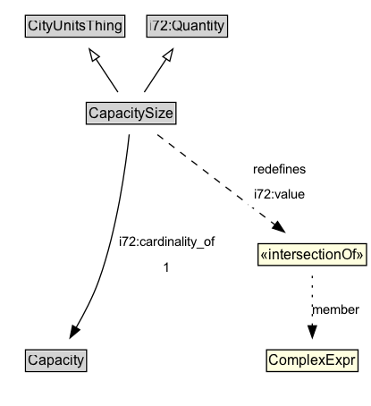

# CapacitySize

**IRI**: `https://w3id.org/citydata/part1/v1/CapacitySize`

## Diagram

=== "SVG (interactive)"

    <!-- Generated by graphviz version 14.1.3 (20260303.0454)
     -->
    <!-- Pages: 1 -->
    <svg width="312pt" height="341pt"
     viewBox="0.00 0.00 312.00 341.00" xmlns="http://www.w3.org/2000/svg" xmlns:xlink="http://www.w3.org/1999/xlink">
    <g id="graph0" class="graph" transform="scale(1 1) rotate(0) translate(4 336.5)">
    <polygon fill="white" stroke="none" points="-4,4 -4,-336.5 307.5,-336.5 307.5,4 -4,4"/>
    <g id="clust3" class="cluster">
    <title>cluster_associated</title>
    </g>
    <!-- CityUnitsThing -->
    <g id="node1" class="node">
    <title>CityUnitsThing</title>
    <g id="a_node1"><a xlink:href="../CityUnitsThing" xlink:title="&lt;TABLE&gt;">
    <polygon fill="lightgray" stroke="none" points="18.25,-306.38 18.25,-322.62 99.75,-322.62 99.75,-306.38 18.25,-306.38"/>
    <text xml:space="preserve" text-anchor="start" x="19.25" y="-310.38" font-family="Arial" font-size="12.00">CityUnitsThing</text>
    <polygon fill="none" stroke="black" points="17.25,-305.38 17.25,-323.62 100.75,-323.62 100.75,-305.38 17.25,-305.38"/>
    </a>
    </g>
    </g>
    <!-- i72_Quantity -->
    <g id="node2" class="node">
    <title>i72_Quantity</title>
    <g id="a_node2"><a xlink:href="https://w3id.org/citydata/21972/v1/Quantity" xlink:title="&lt;TABLE&gt;">
    <polygon fill="lightgray" stroke="none" points="120.12,-306.38 120.12,-322.62 185.88,-322.62 185.88,-306.38 120.12,-306.38"/>
    <text xml:space="preserve" text-anchor="start" x="121.12" y="-310.38" font-family="Arial" font-size="12.00">i72:Quantity</text>
    <polygon fill="none" stroke="black" points="119.12,-305.38 119.12,-323.62 186.88,-323.62 186.88,-305.38 119.12,-305.38"/>
    </a>
    </g>
    </g>
    <!-- CapacitySize -->
    <g id="node3" class="node">
    <title>CapacitySize</title>
    <g id="a_node3"><a xlink:href="../CapacitySize" xlink:title="&lt;TABLE&gt;">
    <polygon fill="lightgray" stroke="none" points="69.38,-233.38 69.38,-249.62 142.62,-249.62 142.62,-233.38 69.38,-233.38"/>
    <text xml:space="preserve" text-anchor="start" x="70.38" y="-237.38" font-family="Arial" font-size="12.00">CapacitySize</text>
    <polygon fill="none" stroke="black" points="68.38,-232.38 68.38,-250.62 143.62,-250.62 143.62,-232.38 68.38,-232.38"/>
    </a>
    </g>
    </g>
    <!-- CapacitySize&#45;&gt;CityUnitsThing -->
    <g id="edge1" class="edge">
    <title>CapacitySize&#45;&gt;CityUnitsThing</title>
    <path fill="none" stroke="black" d="M94.94,-259.21C89.39,-267.59 82.55,-277.93 76.32,-287.34"/>
    <polygon fill="none" stroke="black" points="73.58,-285.14 70.97,-295.41 79.41,-289.01 73.58,-285.14"/>
    </g>
    <!-- CapacitySize&#45;&gt;i72_Quantity -->
    <g id="edge2" class="edge">
    <title>CapacitySize&#45;&gt;i72_Quantity</title>
    <path fill="none" stroke="black" d="M117.06,-259.21C122.61,-267.59 129.45,-277.93 135.68,-287.34"/>
    <polygon fill="none" stroke="black" points="132.59,-289.01 141.03,-295.41 138.42,-285.14 132.59,-289.01"/>
    </g>
    <!-- Invis -->
    <!-- CapacitySize&#45;&gt;Invis -->
    <!-- Capacity -->
    <g id="node5" class="node">
    <title>Capacity</title>
    <g id="a_node5"><a xlink:href="../Capacity" xlink:title="&lt;TABLE&gt;">
    <polygon fill="lightgray" stroke="none" points="18.38,-25.88 18.38,-42.12 67.62,-42.12 67.62,-25.88 18.38,-25.88"/>
    <text xml:space="preserve" text-anchor="start" x="19.38" y="-29.88" font-family="Arial" font-size="12.00">Capacity</text>
    <polygon fill="none" stroke="black" points="17.38,-24.88 17.38,-43.12 68.62,-43.12 68.62,-24.88 17.38,-24.88"/>
    </a>
    </g>
    </g>
    <!-- CapacitySize&#45;&gt;Capacity -->
    <g id="edge7" class="edge">
    <title>CapacitySize&#45;&gt;Capacity</title>
    <path fill="none" stroke="black" d="M104.41,-223.8C101.53,-197.26 94.26,-144.08 79,-101.5 74.07,-87.74 66.61,-73.36 59.77,-61.51"/>
    <polygon fill="black" stroke="black" points="62.89,-59.92 54.76,-53.13 56.88,-63.51 62.89,-59.92"/>
    <polygon fill="white" stroke="none" points="91.94,-101.5 91.94,-144.5 180.19,-144.5 180.19,-101.5 91.94,-101.5"/>
    <text xml:space="preserve" text-anchor="start" x="95.94" y="-130" font-family="Arial" font-size="11.00">i72:cardinality_of</text>
    <text xml:space="preserve" text-anchor="start" x="133.06" y="-108.5" font-family="Arial" font-size="11.00">1</text>
    </g>
    <!-- n644d2ea6622c412bb8909c6637c88453b14 -->
    <g id="node6" class="node">
    <title>n644d2ea6622c412bb8909c6637c88453b14</title>
    <polygon fill="lightyellow" stroke="none" points="212.5,-113.88 212.5,-132.12 303.5,-132.12 303.5,-113.88 212.5,-113.88"/>
    <text xml:space="preserve" text-anchor="start" x="214.5" y="-118.88" font-family="Arial" font-size="12.00">«intersectionOf»</text>
    <polygon fill="none" stroke="black" points="212.5,-113.88 212.5,-132.12 303.5,-132.12 303.5,-113.88 212.5,-113.88"/>
    </g>
    <!-- CapacitySize&#45;&gt;n644d2ea6622c412bb8909c6637c88453b14 -->
    <g id="edge6" class="edge">
    <title>CapacitySize&#45;&gt;n644d2ea6622c412bb8909c6637c88453b14</title>
    <path fill="none" stroke="black" stroke-dasharray="5,2" d="M128.1,-223.56C154.11,-203.63 197.45,-170.41 226.86,-147.87"/>
    <polygon fill="black" stroke="black" points="228.86,-150.74 234.67,-141.88 224.6,-145.19 228.86,-150.74"/>
    <polygon fill="white" stroke="none" points="204.5,-162.5 204.5,-205.5 256.75,-205.5 256.75,-162.5 204.5,-162.5"/>
    <text xml:space="preserve" text-anchor="start" x="208.5" y="-191" font-family="Arial" font-size="11.00">redefines</text>
    <text xml:space="preserve" text-anchor="start" x="209.25" y="-169.5" font-family="Arial" font-size="11.00">i72:value</text>
    </g>
    <!-- Invis&#45;&gt;Capacity -->
    <!-- n644d2ea6622c412bb8909c6637c88453b15 -->
    <g id="node7" class="node">
    <title>n644d2ea6622c412bb8909c6637c88453b15</title>
    <polygon fill="lightyellow" stroke="none" points="219.62,-24.88 219.62,-43.12 296.38,-43.12 296.38,-24.88 219.62,-24.88"/>
    <text xml:space="preserve" text-anchor="start" x="221.62" y="-29.88" font-family="Arial" font-size="12.00">ComplexExpr</text>
    <polygon fill="none" stroke="black" points="219.62,-24.88 219.62,-43.12 296.38,-43.12 296.38,-24.88 219.62,-24.88"/>
    </g>
    <!-- n644d2ea6622c412bb8909c6637c88453b14&#45;&gt;n644d2ea6622c412bb8909c6637c88453b15 -->
    <g id="edge5" class="edge">
    <title>n644d2ea6622c412bb8909c6637c88453b14&#45;&gt;n644d2ea6622c412bb8909c6637c88453b15</title>
    <path fill="none" stroke="black" stroke-dasharray="1,5" d="M258,-105.23C258,-93.31 258,-77.03 258,-63.14"/>
    <polygon fill="black" stroke="black" points="261.5,-63.24 258,-53.24 254.5,-63.24 261.5,-63.24"/>
    <text xml:space="preserve" text-anchor="middle" x="277.88" y="-73.05" font-family="Arial" font-size="11.00">member</text>
    </g>
    </g>
    </svg>

=== "PNG"

    

## Formalization for CapacitySize

| Property | Constraint |
|----------|------------|
| [i72:cardinality_of](https://w3id.org/citydata/21972/v1/cardinality_of) | exactly 1 [Capacity](https://w3id.org/citydata/part1/v1/Capacity) |
| [i72:value](https://w3id.org/citydata/21972/v1/value) | only ComplexExpr |
| subClassOf | [i72:Quantity](https://w3id.org/citydata/21972/v1/Quantity) |
| subClassOf | [CityUnitsThing](CityUnitsThing.md) |

