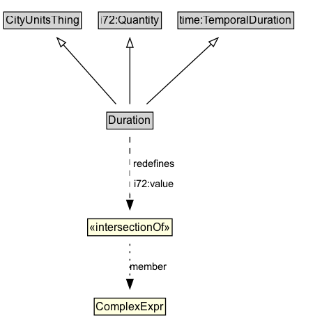

# Duration

Duration is the amount of time that elapses between two instants or events.

**IRI**: `https://w3id.org/citydata/part1/v1/Duration`

## Diagram

=== "SVG (interactive)"

    <!-- Generated by graphviz version 14.1.3 (20260303.0454)
     -->
    <!-- Pages: 1 -->
    <svg width="354pt" height="353pt"
     viewBox="0.00 0.00 354.00 353.00" xmlns="http://www.w3.org/2000/svg" xmlns:xlink="http://www.w3.org/1999/xlink">
    <g id="graph0" class="graph" transform="scale(1 1) rotate(0) translate(4 348.5)">
    <polygon fill="white" stroke="none" points="-4,4 -4,-348.5 349.75,-348.5 349.75,4 -4,4"/>
    <g id="clust3" class="cluster">
    <title>cluster_associated</title>
    </g>
    <!-- CityUnitsThing -->
    <g id="node1" class="node">
    <title>CityUnitsThing</title>
    <g id="a_node1"><a xlink:href="../CityUnitsThing" xlink:title="&lt;TABLE&gt;">
    <polygon fill="lightgray" stroke="none" points="1,-318.38 1,-334.62 82.5,-334.62 82.5,-318.38 1,-318.38"/>
    <text xml:space="preserve" text-anchor="start" x="2" y="-322.38" font-family="Arial" font-size="12.00">CityUnitsThing</text>
    <polygon fill="none" stroke="black" points="0,-317.38 0,-335.62 83.5,-335.62 83.5,-317.38 0,-317.38"/>
    </a>
    </g>
    </g>
    <!-- i72_Quantity -->
    <g id="node2" class="node">
    <title>i72_Quantity</title>
    <g id="a_node2"><a xlink:href="https://w3id.org/citydata/21972/v1/Quantity" xlink:title="&lt;TABLE&gt;">
    <polygon fill="lightgray" stroke="none" points="102.88,-318.38 102.88,-334.62 168.62,-334.62 168.62,-318.38 102.88,-318.38"/>
    <text xml:space="preserve" text-anchor="start" x="103.88" y="-322.38" font-family="Arial" font-size="12.00">i72:Quantity</text>
    <polygon fill="none" stroke="black" points="101.88,-317.38 101.88,-335.62 169.62,-335.62 169.62,-317.38 101.88,-317.38"/>
    </a>
    </g>
    </g>
    <!-- time_TemporalDuration -->
    <g id="node3" class="node">
    <title>time_TemporalDuration</title>
    <g id="a_node3"><a xlink:href="https://w3id.org/citydata/imported/time/latest/TemporalDuration" xlink:title="&lt;TABLE&gt;">
    <polygon fill="lightgray" stroke="none" points="188.38,-318.38 188.38,-334.62 311.12,-334.62 311.12,-318.38 188.38,-318.38"/>
    <text xml:space="preserve" text-anchor="start" x="189.38" y="-322.38" font-family="Arial" font-size="12.00">time:TemporalDuration</text>
    <polygon fill="none" stroke="black" points="187.38,-317.38 187.38,-335.62 312.12,-335.62 312.12,-317.38 187.38,-317.38"/>
    </a>
    </g>
    </g>
    <!-- Duration -->
    <g id="node4" class="node">
    <title>Duration</title>
    <g id="a_node4"><a xlink:href="../Duration" xlink:title="&lt;TABLE&gt;">
    <polygon fill="lightgray" stroke="none" points="111.88,-210.38 111.88,-226.62 159.62,-226.62 159.62,-210.38 111.88,-210.38"/>
    <text xml:space="preserve" text-anchor="start" x="112.88" y="-214.38" font-family="Arial" font-size="12.00">Duration</text>
    <polygon fill="none" stroke="black" points="110.88,-209.38 110.88,-227.62 160.62,-227.62 160.62,-209.38 110.88,-209.38"/>
    </a>
    </g>
    </g>
    <!-- Duration&#45;&gt;CityUnitsThing -->
    <g id="edge1" class="edge">
    <title>Duration&#45;&gt;CityUnitsThing</title>
    <path fill="none" stroke="black" d="M120.86,-236.3C105.55,-253.55 81.55,-280.62 64,-300.42"/>
    <polygon fill="none" stroke="black" points="61.46,-298 57.44,-307.81 66.7,-302.65 61.46,-298"/>
    </g>
    <!-- Duration&#45;&gt;i72_Quantity -->
    <g id="edge2" class="edge">
    <title>Duration&#45;&gt;i72_Quantity</title>
    <path fill="none" stroke="black" d="M135.75,-236.3C135.75,-252.78 135.75,-278.2 135.75,-297.7"/>
    <polygon fill="none" stroke="black" points="132.25,-297.42 135.75,-307.42 139.25,-297.42 132.25,-297.42"/>
    </g>
    <!-- Duration&#45;&gt;time_TemporalDuration -->
    <g id="edge3" class="edge">
    <title>Duration&#45;&gt;time_TemporalDuration</title>
    <path fill="none" stroke="black" d="M153.73,-236.22C172.46,-253.63 202,-281.1 223.37,-300.97"/>
    <polygon fill="none" stroke="black" points="220.87,-303.43 230.58,-307.67 225.64,-298.3 220.87,-303.43"/>
    </g>
    <!-- n644d2ea6622c412bb8909c6637c88453b21 -->
    <g id="node6" class="node">
    <title>n644d2ea6622c412bb8909c6637c88453b21</title>
    <polygon fill="lightyellow" stroke="none" points="90.25,-94.38 90.25,-112.62 181.25,-112.62 181.25,-94.38 90.25,-94.38"/>
    <text xml:space="preserve" text-anchor="start" x="92.25" y="-99.38" font-family="Arial" font-size="12.00">«intersectionOf»</text>
    <polygon fill="none" stroke="black" points="90.25,-94.38 90.25,-112.62 181.25,-112.62 181.25,-94.38 90.25,-94.38"/>
    </g>
    <!-- Duration&#45;&gt;n644d2ea6622c412bb8909c6637c88453b21 -->
    <g id="edge5" class="edge">
    <title>Duration&#45;&gt;n644d2ea6622c412bb8909c6637c88453b21</title>
    <path fill="none" stroke="black" stroke-dasharray="5,2" d="M135.75,-200.83C135.75,-182.88 135.75,-154.04 135.75,-132.58"/>
    <polygon fill="black" stroke="black" points="139.25,-132.76 135.75,-122.76 132.25,-132.76 139.25,-132.76"/>
    <polygon fill="white" stroke="none" points="135.75,-139.5 135.75,-182.5 188,-182.5 188,-139.5 135.75,-139.5"/>
    <text xml:space="preserve" text-anchor="start" x="139.75" y="-168" font-family="Arial" font-size="11.00">redefines</text>
    <text xml:space="preserve" text-anchor="start" x="140.5" y="-146.5" font-family="Arial" font-size="11.00">i72:value</text>
    </g>
    <!-- Invis -->
    <!-- n644d2ea6622c412bb8909c6637c88453b22 -->
    <g id="node7" class="node">
    <title>n644d2ea6622c412bb8909c6637c88453b22</title>
    <polygon fill="lightyellow" stroke="none" points="97.38,-8.88 97.38,-27.12 174.12,-27.12 174.12,-8.88 97.38,-8.88"/>
    <text xml:space="preserve" text-anchor="start" x="99.38" y="-13.88" font-family="Arial" font-size="12.00">ComplexExpr</text>
    <polygon fill="none" stroke="black" points="97.38,-8.88 97.38,-27.12 174.12,-27.12 174.12,-8.88 97.38,-8.88"/>
    </g>
    <!-- n644d2ea6622c412bb8909c6637c88453b21&#45;&gt;n644d2ea6622c412bb8909c6637c88453b22 -->
    <g id="edge4" class="edge">
    <title>n644d2ea6622c412bb8909c6637c88453b21&#45;&gt;n644d2ea6622c412bb8909c6637c88453b22</title>
    <path fill="none" stroke="black" stroke-dasharray="1,5" d="M135.75,-85.6C135.75,-74.62 135.75,-60.04 135.75,-47.32"/>
    <polygon fill="black" stroke="black" points="139.25,-47.39 135.75,-37.39 132.25,-47.39 139.25,-47.39"/>
    <text xml:space="preserve" text-anchor="middle" x="155.62" y="-57.05" font-family="Arial" font-size="11.00">member</text>
    </g>
    </g>
    </svg>

=== "PNG"

    

## Formalization for Duration

| Property | Constraint |
|----------|------------|
| [i72:value](https://w3id.org/citydata/21972/v1/value) | only ComplexExpr |
| subClassOf | [time:TemporalDuration](https://w3id.org/citydata/imported/time/TemporalDuration) |
| subClassOf | [i72:Quantity](https://w3id.org/citydata/21972/v1/Quantity) |
| subClassOf | [CityUnitsThing](CityUnitsThing.md) |

