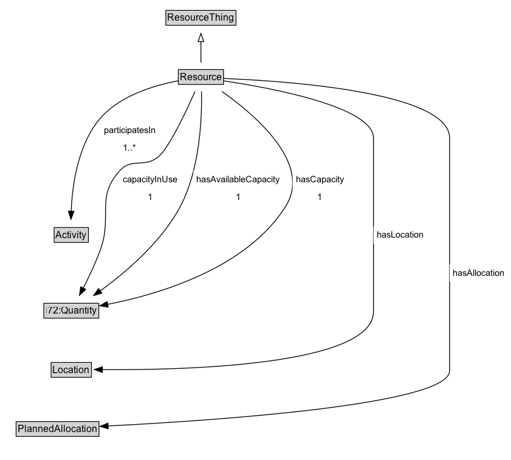

# Resource

A Resource is a generic representation of some Thing that can be "used" in an Activity. 
        A Resource may have some Location, amount or availability, according to the definition of the Manifestation or TimeVaryingEntity. 
        A Resource must be classified as some Resource Type.
        A Resource may participate in some Activity Occurrence. In other words, it links to the Activity that the Resource is being used/consumed/produced/released at the time of the manifestation.
        A specific Resource may be used in or consumed in some activity occurrence.

**IRI**: `https://w3id.org/citydata/part1/v1/Resource`

## Diagram

=== "SVG (interactive)"

    <!-- Generated by graphviz version 14.1.3 (20260303.0454)
     -->
    <!-- Pages: 1 -->
    <svg width="631pt" height="568pt"
     viewBox="0.00 0.00 631.00 568.00" xmlns="http://www.w3.org/2000/svg" xmlns:xlink="http://www.w3.org/1999/xlink">
    <g id="graph0" class="graph" transform="scale(1 1) rotate(0) translate(4 563.5)">
    <polygon fill="white" stroke="none" points="-4,4 -4,-563.5 626.75,-563.5 626.75,4 -4,4"/>
    <g id="clust3" class="cluster">
    <title>cluster_associated</title>
    </g>
    <!-- ResourceThing -->
    <g id="node1" class="node">
    <title>ResourceThing</title>
    <g id="a_node1"><a xlink:href="../ResourceThing" xlink:title="&lt;TABLE&gt;">
    <polygon fill="lightgray" stroke="none" points="201.75,-533.38 201.75,-549.62 286.25,-549.62 286.25,-533.38 201.75,-533.38"/>
    <text xml:space="preserve" text-anchor="start" x="202.75" y="-537.38" font-family="Arial" font-size="12.00">ResourceThing</text>
    <polygon fill="none" stroke="black" points="200.75,-532.38 200.75,-550.62 287.25,-550.62 287.25,-532.38 200.75,-532.38"/>
    </a>
    </g>
    </g>
    <!-- Resource -->
    <g id="node2" class="node">
    <title>Resource</title>
    <g id="a_node2"><a xlink:href="../Resource" xlink:title="&lt;TABLE&gt;">
    <polygon fill="lightgray" stroke="none" points="217.12,-460.38 217.12,-476.62 270.88,-476.62 270.88,-460.38 217.12,-460.38"/>
    <text xml:space="preserve" text-anchor="start" x="218.12" y="-464.38" font-family="Arial" font-size="12.00">Resource</text>
    <polygon fill="none" stroke="black" points="216.12,-459.38 216.12,-477.62 271.88,-477.62 271.88,-459.38 216.12,-459.38"/>
    </a>
    </g>
    </g>
    <!-- Resource&#45;&gt;ResourceThing -->
    <g id="edge1" class="edge">
    <title>Resource&#45;&gt;ResourceThing</title>
    <path fill="none" stroke="black" d="M244,-486.21C244,-493.97 244,-503.42 244,-512.24"/>
    <polygon fill="none" stroke="black" points="240.5,-512.16 244,-522.16 247.5,-512.16 240.5,-512.16"/>
    </g>
    <!-- Invis -->
    <!-- Resource&#45;&gt;Invis -->
    <!-- Activity -->
    <g id="node4" class="node">
    <title>Activity</title>
    <g id="a_node4"><a xlink:href="../Activity" xlink:title="&lt;TABLE&gt;">
    <polygon fill="lightgray" stroke="none" points="63.88,-265.38 63.88,-281.62 104.12,-281.62 104.12,-265.38 63.88,-265.38"/>
    <text xml:space="preserve" text-anchor="start" x="64.88" y="-269.38" font-family="Arial" font-size="12.00">Activity</text>
    <polygon fill="none" stroke="black" points="62.88,-264.38 62.88,-282.62 105.12,-282.62 105.12,-264.38 62.88,-264.38"/>
    </a>
    </g>
    </g>
    <!-- Resource&#45;&gt;Activity -->
    <g id="edge9" class="edge">
    <title>Resource&#45;&gt;Activity</title>
    <path fill="none" stroke="black" d="M216.18,-463.79C187.93,-458.54 144.94,-446.21 120.25,-418 91.89,-385.59 85.13,-334.12 83.84,-302.43"/>
    <polygon fill="black" stroke="black" points="87.35,-302.76 83.61,-292.85 80.35,-302.92 87.35,-302.76"/>
    <polygon fill="white" stroke="none" points="120.25,-370.5 120.25,-413.5 192,-413.5 192,-370.5 120.25,-370.5"/>
    <text xml:space="preserve" text-anchor="start" x="124.25" y="-399" font-family="Arial" font-size="11.00">participatesIn</text>
    <text xml:space="preserve" text-anchor="start" x="147.88" y="-377.5" font-family="Arial" font-size="11.00">1..&#42;</text>
    </g>
    <!-- i72_Quantity -->
    <g id="node5" class="node">
    <title>i72_Quantity</title>
    <g id="a_node5"><a xlink:href="https://w3id.org/citydata/21972/v1/Quantity" xlink:title="&lt;TABLE&gt;">
    <polygon fill="lightgray" stroke="none" points="51.12,-171.88 51.12,-188.12 116.88,-188.12 116.88,-171.88 51.12,-171.88"/>
    <text xml:space="preserve" text-anchor="start" x="52.12" y="-175.88" font-family="Arial" font-size="12.00">i72:Quantity</text>
    <polygon fill="none" stroke="black" points="50.12,-170.88 50.12,-189.12 117.88,-189.12 117.88,-170.88 50.12,-170.88"/>
    </a>
    </g>
    </g>
    <!-- Resource&#45;&gt;i72_Quantity -->
    <g id="edge10" class="edge">
    <title>Resource&#45;&gt;i72_Quantity</title>
    <path fill="none" stroke="black" d="M236.76,-450.73C225.86,-426.13 205.11,-381.93 192,-370.5 174.67,-355.39 158.77,-369.69 143.5,-352.5 114.03,-319.34 134.96,-297.26 120,-255.5 114.13,-239.12 105.76,-221.56 98.56,-207.61"/>
    <polygon fill="black" stroke="black" points="101.82,-206.27 94.06,-199.06 95.62,-209.54 101.82,-206.27"/>
    <polygon fill="white" stroke="none" points="143.5,-309.5 143.5,-352.5 219,-352.5 219,-309.5 143.5,-309.5"/>
    <text xml:space="preserve" text-anchor="start" x="147.5" y="-338" font-family="Arial" font-size="11.00">capacityInUse</text>
    <text xml:space="preserve" text-anchor="start" x="178.25" y="-316.5" font-family="Arial" font-size="11.00">1</text>
    </g>
    <!-- Resource&#45;&gt;i72_Quantity -->
    <g id="edge11" class="edge">
    <title>Resource&#45;&gt;i72_Quantity</title>
    <path fill="none" stroke="black" d="M244.73,-450.74C245.34,-420.66 243.38,-356.3 219,-309.5 195.83,-265.03 151.24,-227.31 119.66,-204.47"/>
    <polygon fill="black" stroke="black" points="121.73,-201.65 111.55,-198.74 117.69,-207.37 121.73,-201.65"/>
    <polygon fill="white" stroke="none" points="234.64,-309.5 234.64,-352.5 345.39,-352.5 345.39,-309.5 234.64,-309.5"/>
    <text xml:space="preserve" text-anchor="start" x="238.64" y="-338" font-family="Arial" font-size="11.00">hasAvailableCapacity</text>
    <text xml:space="preserve" text-anchor="start" x="287.01" y="-316.5" font-family="Arial" font-size="11.00">1</text>
    </g>
    <!-- Resource&#45;&gt;i72_Quantity -->
    <g id="edge12" class="edge">
    <title>Resource&#45;&gt;i72_Quantity</title>
    <path fill="none" stroke="black" d="M269.84,-450.66C310.46,-422.03 381.44,-361.86 349,-309.5 300.84,-231.75 190.61,-199.92 128.56,-187.79"/>
    <polygon fill="black" stroke="black" points="129.52,-184.41 119.05,-186.03 128.24,-191.29 129.52,-184.41"/>
    <polygon fill="white" stroke="none" points="357.24,-309.5 357.24,-352.5 424.49,-352.5 424.49,-309.5 357.24,-309.5"/>
    <text xml:space="preserve" text-anchor="start" x="361.24" y="-338" font-family="Arial" font-size="11.00">hasCapacity</text>
    <text xml:space="preserve" text-anchor="start" x="387.87" y="-316.5" font-family="Arial" font-size="11.00">1</text>
    </g>
    <!-- Location -->
    <g id="node6" class="node">
    <title>Location</title>
    <g id="a_node6"><a xlink:href="../Location" xlink:title="&lt;TABLE&gt;">
    <polygon fill="lightgray" stroke="none" points="60.12,-98.88 60.12,-115.12 107.88,-115.12 107.88,-98.88 60.12,-98.88"/>
    <text xml:space="preserve" text-anchor="start" x="61.12" y="-102.88" font-family="Arial" font-size="12.00">Location</text>
    <polygon fill="none" stroke="black" points="59.12,-97.88 59.12,-116.12 108.88,-116.12 108.88,-97.88 59.12,-97.88"/>
    </a>
    </g>
    </g>
    <!-- Resource&#45;&gt;Location -->
    <g id="edge8" class="edge">
    <title>Resource&#45;&gt;Location</title>
    <path fill="none" stroke="black" d="M271.85,-463.73C329.58,-455.14 457,-431.78 457,-393 457,-393 457,-393 457,-179 457,-111.36 217.29,-106.54 122.2,-107.29"/>
    <polygon fill="black" stroke="black" points="122.3,-103.79 112.34,-107.39 122.38,-110.79 122.3,-103.79"/>
    <polygon fill="white" stroke="none" points="457,-262.75 457,-284.25 522.75,-284.25 522.75,-262.75 457,-262.75"/>
    <text xml:space="preserve" text-anchor="start" x="461" y="-269.75" font-family="Arial" font-size="11.00">hasLocation</text>
    </g>
    <!-- PlannedAllocation -->
    <g id="node7" class="node">
    <title>PlannedAllocation</title>
    <g id="a_node7"><a xlink:href="../PlannedAllocation" xlink:title="&lt;TABLE&gt;">
    <polygon fill="lightgray" stroke="none" points="16.88,-25.88 16.88,-42.12 117.12,-42.12 117.12,-25.88 16.88,-25.88"/>
    <text xml:space="preserve" text-anchor="start" x="17.88" y="-29.88" font-family="Arial" font-size="12.00">PlannedAllocation</text>
    <polygon fill="none" stroke="black" points="15.88,-24.88 15.88,-43.12 118.12,-43.12 118.12,-24.88 15.88,-24.88"/>
    </a>
    </g>
    </g>
    <!-- Resource&#45;&gt;PlannedAllocation -->
    <g id="edge7" class="edge">
    <title>Resource&#45;&gt;PlannedAllocation</title>
    <path fill="none" stroke="black" d="M271.79,-466.66C347.36,-463.64 551,-450.18 551,-393 551,-393 551,-393 551,-106 551,-63.85 259.98,-44.38 129.27,-37.76"/>
    <polygon fill="black" stroke="black" points="129.55,-34.27 119.39,-37.27 129.21,-41.26 129.55,-34.27"/>
    <polygon fill="white" stroke="none" points="551,-216 551,-237.5 622.75,-237.5 622.75,-216 551,-216"/>
    <text xml:space="preserve" text-anchor="start" x="555" y="-223" font-family="Arial" font-size="11.00">hasAllocation</text>
    </g>
    <!-- Invis&#45;&gt;Activity -->
    <!-- Activity&#45;&gt;i72_Quantity -->
    <!-- i72_Quantity&#45;&gt;Location -->
    <!-- Location&#45;&gt;PlannedAllocation -->
    </g>
    </svg>

=== "PNG"

    

## Specializations of Resource

| Class | Description |
|-------|-------------|
| [Divisible Resource](DivisibleResource.md) | A Resource that can be divided for use or consumption between multiple Activities. |
| [Non Divisible Resource](NonDivisibleResource.md) | A Resource that can only be used for a single Activity at once - even if it isn't fully utilized. |

## Formalization for Resource

| Property | Constraint |
|----------|------------|
| [capacityInUse](../properties/capacityInUse.md) | exactly 1 |
| [capacityInUse](../properties/capacityInUse.md) | exactly 1 [i72:Quantity](https://w3id.org/citydata/21972/v1/Quantity) |
| [hasAllocation](../properties/hasAllocation.md) | only [PlannedAllocation](PlannedAllocation.md) |
| [hasAllocation](../properties/hasAllocation.md) | only [PlannedAllocation](https://w3id.org/citydata/part1/v1/PlannedAllocation) |
| [hasAvailableCapacity](../properties/hasAvailableCapacity.md) | exactly 1 |
| [hasAvailableCapacity](../properties/hasAvailableCapacity.md) | exactly 1 [i72:Quantity](https://w3id.org/citydata/21972/v1/Quantity) |
| [hasCapacity](../properties/hasCapacity.md) | exactly 1 |
| [hasCapacity](../properties/hasCapacity.md) | exactly 1 [i72:Quantity](https://w3id.org/citydata/21972/v1/Quantity) |
| [hasLocation](../properties/hasLocation.md) | only [Location](Location.md) |
| [hasLocation](../properties/hasLocation.md) | only [Location](https://w3id.org/citydata/part1/v1/Location) |
| [participatesIn](../properties/participatesIn.md) | min 1 |
| [participatesIn](../properties/participatesIn.md) | min 1 [Activity](https://w3id.org/citydata/part1/v1/Activity) |
| subClassOf | [ResourceThing](ResourceThing.md) |

## Used by classes

| Class | Property |
|-------|----------|
| [Terminal Resource State](TerminalResourceState.md) | [hasResource](../properties/hasResource.md) |

