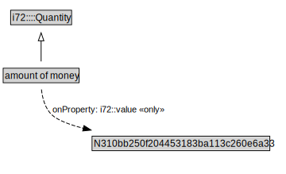

# amount of money

<a href="../../diagrams/amount of money.svg">Open interactive amount of money diagram</a>

## Specializations of amount of money

| Class | Description |
|-------|-------------|
| [Value Of Money](ValueOfMoney.md) |  |

## Formalization for amount of money

| Property | Value Restriction | Definition |
|----------|-------------------|------------|
| i72::value | only N310bb250f204453183ba113c260e6a33 | None |
| rdfs:subClassOf | i72::Quantity | --- |

