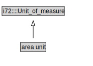

# area unit

<a href="../../diagrams/area unit.svg">Open interactive area unit diagram</a>

## Formalization for area unit

| Property | Value Restriction | Definition |
|----------|-------------------|------------|
| rdfs:subClassOf | i72::Unit_of_measure | --- |

