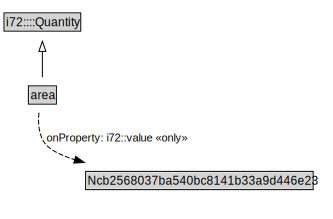

# area

<a href="../../diagrams/area.svg">Open interactive area diagram</a>

## Formalization for area

| Property | Value Restriction | Definition |
|----------|-------------------|------------|
| i72::value | only Ncb2568037ba540bc8141b33a9d446e23 | None |
| rdfs:subClassOf | i72::Quantity | --- |

