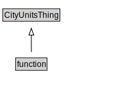

# function

<a href="../../diagrams/function.svg">Open interactive function diagram</a>

## Formalization for function

| Property | Value Restriction | Definition |
|----------|-------------------|------------|
| rdfs:subClassOf | [CityUnitsThing](CityUnitsThing.md) | --- |

