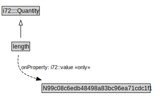

# length

<a href="../../diagrams/length.svg">Open interactive length diagram</a>

## Formalization for length

| Property | Value Restriction | Definition |
|----------|-------------------|------------|
| i72::value | only [N99c08c6edb48498a83bc96ea71cdc1f1](N99c08c6edb48498a83bc96ea71cdc1f1.md) | None |
| rdfs:subClassOf | i72::Quantity | --- |

