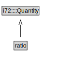

# ratio

<a href="../../diagrams/ratio.svg">Open interactive ratio diagram</a>

## Formalization for ratio

| Property | Value Restriction | Definition |
|----------|-------------------|------------|
| rdfs:subClassOf | i72::Quantity | --- |

