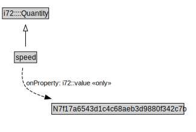

# speed

<a href="../../diagrams/speed.svg">Open interactive speed diagram</a>

## Formalization for speed

| Property | Value Restriction | Definition |
|----------|-------------------|------------|
| i72::value | only N7f17a6543d1c4c68aeb3d9880f342c7b | None |
| rdfs:subClassOf | i72::Quantity | --- |

