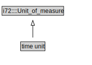

# time unit

<a href="../../diagrams/time unit.svg">Open interactive time unit diagram</a>

## Formalization for time unit

| Property | Value Restriction | Definition |
|----------|-------------------|------------|
| rdfs:subClassOf | i72::Unit_of_measure | --- |

## time unit Is Used By

- [CardinalityUnitPerTime](CardinalityUnitPerTime.md).has denominator

